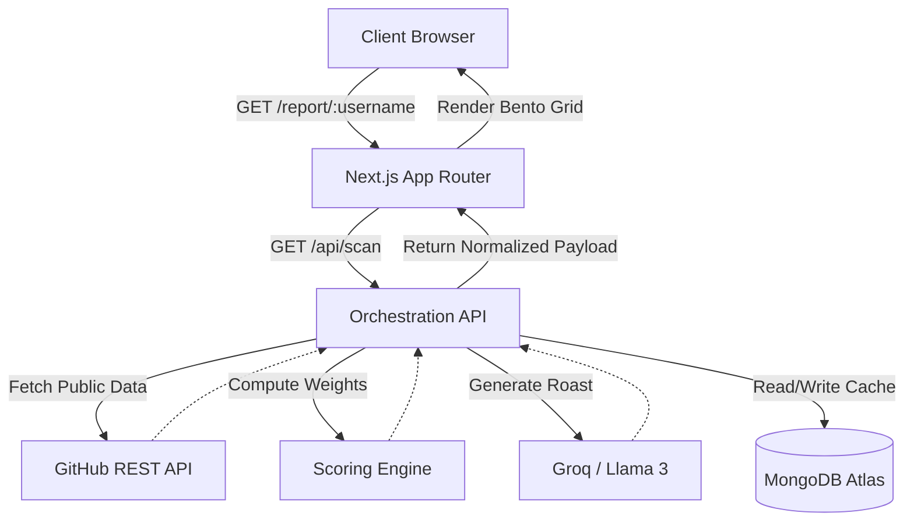
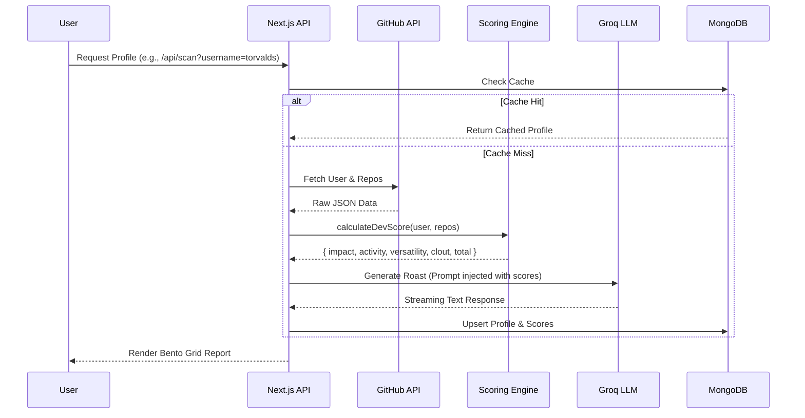
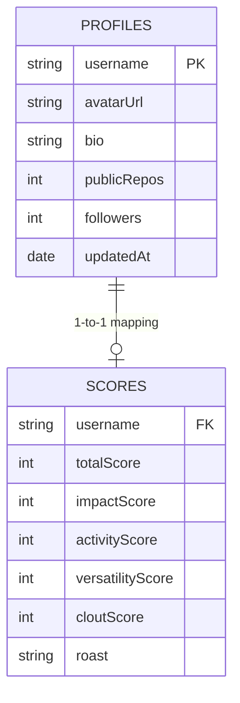

# DevRoast

A dynamic Proof-of-Work (PoW) generator and scoring engine for GitHub profiles. Built on Next.js App Router, it fetches live repository data, computes weighted developer metrics, and utilizes an LLM to generate a customized profile analysis.

## System Architecture



## Technical Stack

*   **Framework:** Next.js 15 (App Router, React 19)
*   **Styling:** Tailwind CSS v4
*   **Language:** TypeScript (Strict mode enabled)
*   **Database:** MongoDB Atlas (Mongoose)
*   **AI/LLM:** Groq API (Llama-3.3-70b-versatile)
*   **Performance:** `@chenglou/pretext` for zero-layout-shift UI streaming, Upstash/Redis rate limiting

## Core Data Flow

The application executes a sequence of data normalization and scoring without utilizing mock data. The scoring engine operates as a pure, testable function.



## Scoring Engine Mechanics

The `calculateDevScore` function (`lib/scoring.ts`) computes a weighted `DevScore` from 0-100 based on four primary vectors:

1.  **Impact (40%):** Stars and forks across public repositories.
2.  **Activity (30%):** Commit frequency and recent repository updates.
3.  **Versatility (15%):** Number of unique languages utilized.
4.  **Clout (15%):** Follower-to-following ratio and sheer follower volume.

## Database Schema



## Setup & Local Development

1.  **Clone & Install**
    ```bash
    git clone https://github.com/itxashancode/devroast.git
    cd devroast
    npm install
    ```

2.  **Environment Variables**
    Create a `.env.local` file in the root directory:
    ```env
    # Optional: Increases API rate limits from 60 to 5000 req/hr
    GITHUB_TOKEN=your_github_personal_access_token

    # Required: Groq API key for LLM generation
    GROQ_API_KEY=your_groq_api_key

    # Required: MongoDB connection string
    MONGODB_URI=mongodb+srv://<user>:<password>@cluster.mongodb.net/devroast
    ```

3.  **Run Development Server**
    ```bash
    npm run dev
    ```
    Access the application at `http://localhost:3000`.

## License
MIT
